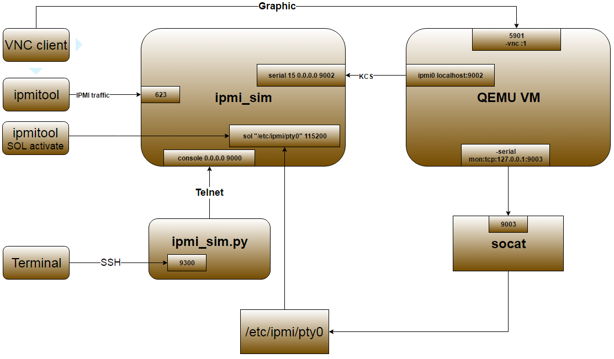

Development Guide
=========================

Repositories
------------------------------------------------

The InfraSIM repositories provide you with the code to set up, configure, and test a virtual environment consisting of simulated servers, storage devices, and smart PDUs. A thorough understanding of the individual repositories is essential for contributing to the project.

.. list-table::
   :widths: 25 35 40
   :header-rows: 1

   * - Application
     - Repository
     - Description
   * - IDIC
     - https://github.com/InfraSIM/idic
     - Idic repository includes vBMC, vCompute, and vPDU. vBMC is the base OS of virtual BMC. vCompute simulates the common functionalities of a compute node and the behaviors of a generic server and several servers from vendors like Dell, Quanta, etc.
   * - vpduserv
     - https://github.com/InfraSIM/vpduserv
     - Simulates the behaviors of the IPI PANDUIT PDU which conforms with vendor and open source specified licenses.
   * - QEMU
     - https://github.com/InfraSIM/qemu
     - QEMU is a generic and open source machine emulator and virtualizer, more information please access http://wiki.qemu-project.org/.
   * - OpenIPMI
     - https://github.com/InfraSIM/openipmi
     - OpenIPMI library, a library that makes it simple to build complex IPMI management software.
   * - Test
     - https://github.com/InfraSIM/test
     - Scripts for InfraSIM automation and integration tests. It includes the test framework(puffer) and many test cases against the features InfraSIM provided.
   * - Tools
     - https://github.com/InfraSIM/tools
     - Various tools and scripts to monitor and manage generic and common virtual nodes, virtual rack build.
   * - vRacksystem
     - https://github.com/InfraSIM/vracksystem
     - The vRacksystem provides both REST APIs and WebGUI for deploying and configuring vNode/vPDU to compose virtual racks.
   * - docs
     - https://github.com/InfraSIM/docs
     - The InfraSIM documentation available at http://InfraSIM.readthedocs.org/en/latest/.

Development conventions
------------------------------------------------

**Forrest - Under construction**

3rd-party binaries notes
------------------------------------------------

**Bryan - Under construction**

Component design notes
------------------------------------------------

**Bryan - Under construction**

Logging and debugging
------------------------------------------------

**Mark - Under construction**

Unit test
------------------------------------------------

**Mark - Under construction**

Functional test
------------------------------------------------

**Mark - Under construction**

Integration test
------------------------------------------------

Puffer is test framework developed for InfraSIM integration testing. Source code is in `InfraSIM/test <https://github.com/InfraSIM/test>`_. It is a framework which can be easily extended to test products of different type, for example, standalone or web-based software and firmware. Here's its block diagram.

          .. image:: _static/puffer_architecture.png
             :align: center
             
For any test target specified, those target behavior encapsulation need to be developed and a set of tests cases need to be added on top of encapsulation layer. `Write test case <how_tos.html#write-test-case>`_ described how to work out one test cases against InfraSIM. Below sections introduced all details about setting up buffer and execute InfraSIM testing with it.

Setup environment
~~~~~~~~~~~~~~~~~~~~~~~~~~~~~~~~~~~~~~~~~~
Refer to the section 7.1 Physical Servers and ESXi Environment Setup.

Code::

    git clone https://github.com/InfraSIM/test.git

Install necessary package::

    sudo python test/install/PackageInstall.py

Define environment
~~~~~~~~~~~~~~~~~~~~~~~~~~~~~~~~~~~~~~~~~~~~~~~~~~~~~~~~~~~~~~~~
You can see a configuration file example in test/configure/stack_example.json.
To test  your environment, you must define your environment in a file, and it must be in a valid JSON format.

#. Define the overall test environment.

   *  `(Optional)` `vRackSystem <userguide.html#vracksystem>`_  - The test may leverage vRackSystem and have REST talk.
   * available_Hypervisor - A list of hypervisors information. If your test has to handle hypervisors, this attribute is a required.
   * vRacks - A list of virtual racks you have built.

   ::

    {
        "vRackSystem": {},
        "available_HyperVisor": [],
        "vRacks": [],
    }

#. `(Optional)` Define `vRackSystem <userguide.html#vracksystem>`_  key information for REST interaction, this definition can be an empty dictionary::

    {
        "protocol": "http",
        "ip": "192.168.1.1",
        "port": 8888,
        "username": "admin",
        "password": "admin",
        "root": "/api/v1"
    }

#. Specify hypervisor information using available_HyperVisor.

   For a single definition, here is an example::

    {
        "name": "hyper1",
        "type": "ESXi",
        "ip": "192.168.1.2",
        "username": "username",
        "password": "password"
    }

#. Specify a list of vRacks. Each definition includes:

   * name - any name you like.

   * hypervisor - The hypervisor you used in above definition. All virtual node, PDU, and switch are deployed on this hypervisor.

   * vPDU - A list of virtual PDU definition. The list can be empty.

   * vSwitch - A list of virtual switch definition. The list can be empty.

   * vNode - A list of virtual node definition. The list can be empty.

   They are organized in the following list::

    {
        "name": "vRack1",
        "hypervisor": "hyper1",
        "vPDU": [],
        "vSwitch": [],
        "vNode": []
    }

#. Specify a list of virtual PDUs. For each definition, you need to maintain:

   * name - virtual PDU's name in hypervisor

   * datatstore - on which datastore this PDU is deployed.

   * community - control community for SNMP access.

   * ip - PDU IP

   * outlet - A mapping of outlet to corresponding control password.

   Example::

    {
        "name": "vpdu_1",
        "datastore": "Datastore01",
        "community": "foo",
        "ip": "172.31.128.1",
        "outlet": {
            "1.1": "bar",
            "1.2": "bar",
            "1.3": "bar"
        }
    }

#. vSwitch is currently not enabled.

#. Specify a list of virtual nodes. For each definition, you need to maintain:

   * name - The virtual node's name in hypervisor.

   * datastore - The datastore this node is deployed on.

   * power - A list of power control connection, each connection defines a specific PDU and outlet, you may have two power control, if this list is empty, node will not be controlled by any PDU.

   * network - A definition for connection to virtual switch, currently not used.

   * bmc - A definition on how to access virtual BMC of this node, including IP, username and password for ipmi over LAN access.

   Example::

    {
        "name": "vnode_a_20160126114700",
        "datastore": "Datastore01",
        "power": [
            {"vPDU": "vpdu_1", "outlet": "1.1"},
        ],
        "network": [],
        "bmc": {
            "ip": "172.31.128.2",
            "username": "admin",
            "password": "admin"
        }
    }

   **Verify every IP is available from your test execution environment!**

   **Verify PDU can access substream hypervisor!** (see chapter 7.1.3 vPDU Configuration for detail)

Case Runtime Data
~~~~~~~~~~~~~~~~~~~~~~~~
Case Runtime Data used to maintain some specific data for different test objects. These data generally require the user to add and update manually. For example, if you want to test one type of sensor for multiple nodes, you need to add and update sensor ID corresponds to each node.

#. Configuration file:

   Case Runtime Data is defined in the json file which have same name with case script. If name of case script is T0000_test_HelloWorld.py, the name of runtime data shall be T0000_test_HelloWorld.json.

   Here's an example::

    [
        {
            "name_1": "value_1",
            "name_2": "value_2"
        }
    ]
    
   If your configuration json like above, you can get "value_1" by call self.data["name_1"] in test case.

   Here's another example::

    [
        {
            "node_1": "0x00",
            "node_2": "0x01"
        },
        {
            "node_1": "0x02",
            "node_2": "0x03"
        }
    ]

   If your configuration json has two objects in an array like above, same case shall be run twice for each runtime data.

   You will get "0x00" by call self.data["node_1"] in test case for the first time, and "0x02" for the second time.

#. Test Result:

   You shall get two separate result and a summary. Case's final result is the worst result for all execution.

   For example, if the case "failed" in first time and "passed" in second time, the final result is still "failed", the summary will list all run results.

Run test
~~~~~~~~~~~~~~~~~~~~~~~~~
Trigger test::

    cd test
    python puffer.py -s infrasim --stack=<your_configuration>

<your_configuration> can be an absolute or related path of your configuration file.
About how to run test, please check readme for detail::

    cat README.md

You log file is kept in a folder of log/InfraSIM, each test task is packaged in a folder
with time stamp as it's folder name.

Write test case
~~~~~~~~~~~~~~~~~~~~~~~~~

This section introduces how to write test case in puffer.

#. Create a test script file

   * **Test Case Name**

     The name of test case should follow the same format::

        T\d+_[a-z0-9A-Z]+_[a-z0-9A-Z]+

     In puffer, test case name should:
      - Start with capital letter **T** and case id
      - Followed by the **field type** and **short description** about this case with underscores in the interval. Field types defined in class CBaseCase.

        **Note:** The field type for InfraSIM is **idic**.

     For example, a test case named **T123456_idic_CheckPowerStatus**:
      - **T** is short for test
      - **123456** for case id
      - **idic** for field type
      - **check the power status** for the short description

   * **Test Suite**

     You should put your test case scripts into **<puffer_directory>/case/<test_suite>**. Each folder under **<puffer_directory>/case** is a test suite. When you give the suite folder to puffer.py as a parameter, puffer will executes all test case scripts which in the folder, including subfolders.

#. Create case runtime data file

   Case Runtime Data is used to maintain some specific data for different test objects. These data generally require the user to add and update manually.

   The format of case runtime data defined in the json file which have same name and folder with case script. Please see the chapter `Case Runtime Data <userguide.html#case-runtime-data>`_ .

#. Write test case

   A. Import CBaseCase

      Class CBaseCase defined in **<puffer_directory>/case/CBaseCase.py**, contains some member functions to help test case running::

          from case.CBaseCase import *

   B. Class Declaration

      We declaration each case as subclass of class CBaseCase and the class name is case name. For example, if case name is T123456_idic_CheckPowerStatus, the class name should be same to it.

      A test case maybe looks like::

          from case.CBaseCase import *

          class T000000_firmware_shortdescription(CBaseCase):

              def __init__(self):
                  CBaseCase.__init__(self, self.__class__.__name__)

              def config(self):
                  CBaseCase.config(self)

              def test(self):
                  pass

              def deconfig(self):
                  CBaseCase.deconfig(self)

      And then, we need to override methods of class CBaseCase, such as config(), test() and deconfig().

   C. Override config()

      This method configuration system to expected status, configuration runtime HWIMO environment and stack environment.

      The HWIMO configuration will set logger to save session log into log file and configuration SSH agent and stack configuration will build stack object, configuration stack ABS according to dict, build all nodes and power on.

      However, in some case we want to enable some components we need to enable manually in configuration(). For example, if we want to use the ssh inside vbmc, we need enable the bmc_ssh in configuration()::

          def config(self):
              CBaseCase.config(self)
              self.enable_bmc_ssh()

   D. Override test()

      This method is the main part of the test.

      You can:

      - Use self.stack to get the stack which build in config().

      - Use self.data[] to get case runtime data.

      - Use self.monorail to use Monorail API.

      - Use self.log() to log the information.

      - Use self.result() to save the case result.

      For example::

          def test(self):
              #get racks from stack and get nodes from rack
              for obj_rack in self.stack.get_rack_list():
                  for obj_node in obj_rack.get_node_list():

                      #log the information
                      self.log('INFO', 'Check node {} of rack {} ...'
                          .format(obj_node.get_name(), obj_rack.get_name()))

                      #get and match outlet power
                      for power_unit in obj_node.power:
                          pdu_pwd = power_unit[0].get_outlet_password(power_unit[1])
                          power_unit[0].match_outlet_password(power_unit[1], pdu_pwd)

                      #virtual node power control
                      obj_node.power_on()

                      #use case runtime data
                      node_name = obj_node.get_name()
                      node_lan_channel = self.data[node_name]

                      #send command to virtual bmc through ssh
                      obj_bmc = obj_node.get_bmc()
                      bmc_ssh = obj_bmc.ssh
                      ssh_rsp = bmc_ssh.send_command_wait_string(
                          str_command = 'ipmitool -I lanplus -H localhost -U {} -P {} lan print {} {}'.format(obj_bmc.get_username(), obj_bmc.get_password(), node_lan_channel, chr(13)),
                          wait = '$',
                          int_time_out = 3,
                          b_with_buff = False)

                      #send command to virtual bmc through ipmitool
                      ret, ipmi_rsp = obj_node.get_bmc().ipmi.ipmitool_standard_cmd('lan print')

                      #if case failed
                      if ret != 0:
                          self.result(FAIL, 'FAIL_INFORMATION')
                      else:
                      #if no issue in this run, case pass.
                          self.log('INFO', 'PASSED.')

   E. Override deconfig()

      This method deconfig system to expected status, reset REST and SSH sessions, deconfig stack and log handler::

          def deconfig(self):
              self.log('INFO', 'Deconfig')
              CBaseCase.deconfig(self)

