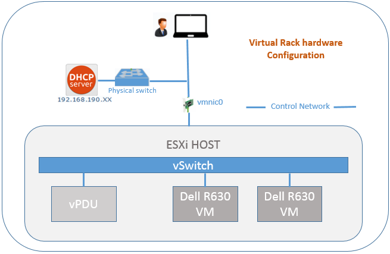

Getting started
=========================

This chapter describes how to access virtual server, virtual PDU and virtual infrastructure provided by InfraSIM.

Virtual Server
------------------------------------------------

Command interfaces
~~~~~~~~~~~~~~~~~~~~~

#. Initialization (you need do it once) ::

    sudo infrasim-init

#. Start Infrasim Service::

    sudo infrasim-main start

#. Status and version number check::

    sudo infrasim-main status
    sudo infrasim-main version    

#. Stop Infrasim Service::

    sudo infrasim-main stop

Interface to access virtual server
~~~~~~~~~~~~~~~~~~~~~~~~~~~~~~~~~~~~~~~~~

#. Server graphic UI
VNC viewer through port **5901**. If you can also port-forward guest VNC default port 5901 to host port (for example, 15901). So, you can access VNC service via host 15901 port. You can see the virtual monitor is already running and listing boot devices of virtual node. Through this booting devices, you can deploy hypervisor or operating system into virtual compute node.

	  .. image:: _static/vnc.png

#. Virtual BMC

   * Install ipmitool on host machine.::

		sudo apt-get install ipmitool

    IPMI over LAN::

		ipmitool -I lanplus -U admin -P admin -H <IP address> sdr list

    .. note:: <IP address> is address of NIC assigned to BMC access in YAML configuration file

    IPMI over internal path (vKCS) which requires OS and ipmitool application deployed inside virtual server::

        ipmitool sdr list

    You can get the command result like the following ::

		Pwr Unit Status  | Not Readable      | ns
		IPMI Watchdog    | Not Readable      | ns
		FP NMI Diag Int  | Not Readable      | ns
		SMI TimeOut      | Not Readable      | ns
		System Event Log | Not Readable      | ns
		System Event     | Not Readable      | ns
        ...

Virtual Power Distribution Unit - Robert - Under construction
------------------------------------------------

 Current Virtual PDU implementation only supports running entire virutal infrastructure on VMWare ESXi because it only supports functionality of simulating power control chassis through VMWare SDK.

Setup a mini InfraSIM Virtual infrastructure on ESXi
---------------------------------------------------------

Combining virtual server, virtual PDU and virtual switch, you can quickly deploy a small virtual infrastructure system. Here's a expamle to explicitly list to to setup one small virtual rack with 2 Dell R630 nodes and 1 virtual PDU on VMWare ESXi:

    #. Get ESXi environment prepared by following `instruction <how_to.html#how-to-install-vmware-esxi-on-physical-server>`_ 
    #. Spin up 3 virtual machines with satisfying `resrouces <installation.html#resource-requirement>`_ - 2 for hosting virtual Dell servers and the other one for virtual PDU
    #. Configure virtual switch to compose desired data network topology. `Virtual server networking <configuration.html#networking>`_ only covers virtual nodes networking; for configuring "outside network", you need to refer to VMWare ESXi manual in order to properly connect these 3 virtual machines together.
    #. Install InfraSIM application by following `intallation guide <installation.html#installation>`_
    #. Modify YAML configuration file as specified in `Configuration file <configuration.html#virtual-server-configuration-file>`_
    #. Kick off all InfraSIM `services <get_start.html#command-interfaces>`_
    #. Done, enjoy this virtual stack!

