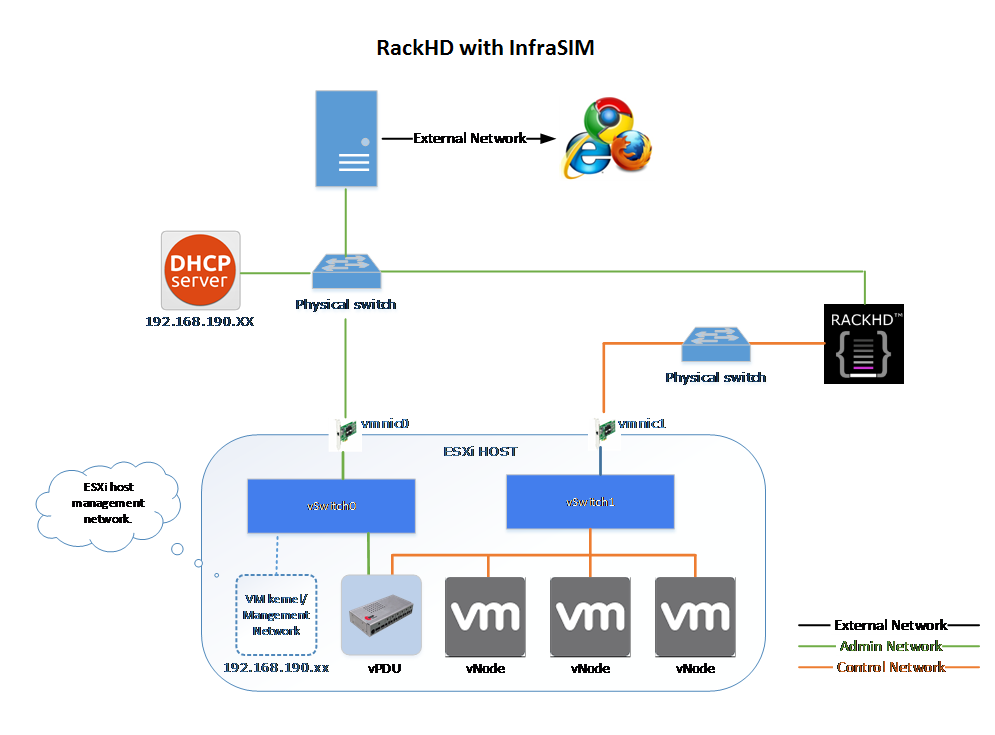
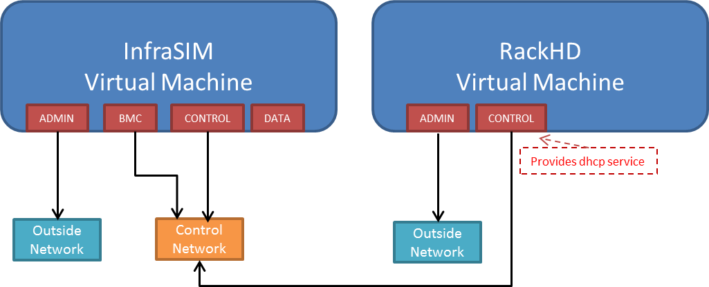

How To
=========================

How to install VMWare ESXi on Physical Server
------------------------------------

.. _Requirement of physical server:

#. Requirement of physical server
    The physical server must support ESXi 6.0 and it should be allocated at least 3 NIC ports. The first NIC port is used for the admin network connection. The second and third NIC ports are used for control network connection(The second NIC is required. The third NIC is optional). The fourth NIC port is used for data network connection (optional).

    Virtual InfraSIM servers runs in the best performance if hardware-assisting technology has been enabled on underlying physical machines. These technology includes VT-d feature and AMD-V for processors from Intel and AMD.

    .. note:: **Physical machine** - enable VT-d in BIOS

        .. image:: _static/configBIOSpng.png
            :height: 400
            :align: center

#. Setting Up Network Connections
    You must have IP addresses for the physical servers in the test environment to be used to configure the VMKernal port of ESXi and called as ESXi_Admin_IP.

    * Allocate or reserve a static IP address from the Lab admin.
    * Connect the server’s admin NIC ports into the Lab network.
    * To set up a multiple server environment, connect Port C1 on each server by using an Ethernet switch.

#. Install ESXi 6.0
    From the VMWare web site, a 60-day free trial version is available after user registration.

    * Go to https://my.vmware.com/web/vmware/details?downloadGroup=ESXI600&productId=490&rPId=7539
    * Download the VMWare vSphere Hypervisor 6.0 (ESXi6.0) ISO image.
    * Install ESXi 6.0 on each physical server.
    * Configure the static IP address ESXi_Admin_IP on first NIC port.
    * Set the Administrator user name by using the format <User Name>.
    * Set the Administrator Password by using the format <Password>.

#. Installing VMWare vSphere Client (Remote System)
    * Go to the VMWare web site.
    * Download the VMWare vSphere Client.
    * Install the client on a remote system that can connect to the physical servers.

#. Configuring the Virtual Network
    * Launch the vSphere client and connect to ESXi on the physical server by using ESXi_Admin_IP.

    * On the Configuration tab, click Add Networking, to create the Control vSwitch. In the example, the network label is "VM Network 2".
    
        .. image:: _static/virtualnetwork1.png
            :height: 400
            :align: center

    * Select Virtual Machine
    
        .. image:: _static/virtualnetwork2.png
            :height: 400
            :align: center

    * Select Create a vSphere standard switch > vmnic2.
    
        .. image:: _static/virtualnetwork3.png
            :height: 400
            :align: center

    * In the Network Label field, type port group name on target switch.
    
        .. image:: _static/virtualnetwork4.png
            :height: 300
            :align: center

    * Enable the SSH service on ESXi. To do this, open the Configuration tab and select Security Profile. Then select SSH and click Properties to set the SSH (TSM-SSH) to start and stop manually.

        .. note:: Login to the ESXi server through SSH and echo by issuing the **"vhv.enable = "TRUE""** command to the /etc/vmware/config file. This command enables nested ESXi and other hypervisors in vSphere 5.1 or higher version. This step only needs to be done once by using the command: echo 'vhv.enable = "TRUE"' >> /etc/vmware/config.
    
            .. image:: _static/ssh_ESXi.png
                :height: 300
                :align: center

        .. note:: Set **Promiscuous Mode** to Accept and tick Override. To do this, open the Configuration tab and select Networking. Then click Properties of the vSwitch, choose port group, edit, security, tick the checkbox to override setting and select Accept.    
    
            .. image:: _static/virtualnetwork5.png
                :height: 300
                :align: center

How to deploy InfraSIM virtual server on different type of platforms
------------------------------------------------------------------------------------

There are desires to deploy virtual server on different types of hypervisor like:
    -  `VirtualBox <https://www.virtualbox.org/>`_
    -  `KVM <http://www.linux-kvm.org>`_
    -  `VMWare product <https://www.vmware.com>`_, both VMWare vSphere or VMWare workstation

2 possible ways to achieve this:

* Create virtual machine image for corresponding hypervisor beforehand and them import that image onto hypervisors - InfraSIM application is ready in operating system running in virtual machines or containers on top of specified hypervisor or platform. These images are: OVA file for VMWare workstation or vSphere; QCOW2 file for KVM/QEMU; BOX or vagrant/VirtualBox, etc. Below listed some steps on how to deploy these template into different systems:

* Spin-up virtual machines running Ubuntu 64-bit 16.04 OS on desired hypervisor and then install infrasim-compute application. You may also leverage Chef or Ansible to deploy multiple virtual server instances into multiple virtual machines.   

How to simulate another server
---------------------------------------------
InfraSIM also provided many utilities, interfaces for developers to build one simulation solution for a physical node that has not been supported by infraSIM.
This sections walk through steps required to build one simulation for one specific server node.
While you may find some helpful utilities from `InfraSIM tools <https://github.com/InfraSIM/tools>`_ repository.

#. Collect SMBIOS

   You need access to hardware so boot an OS on target machine you want to simulate.
   We've tried both on Ubuntu 14.04 and 16.04, so they are recommended.
   Clone `tools <https://github.com/InfraSIM/tools>`_ to your OS, install ``dmidecode``::

    $ cd tools/dmidecode-2.12
    $ make
    $ make install

   Collect SMBIOS data with the newly installed ``dmidecode``::

    $ dmidecode --dump-bin <your-vnode-name>_smbios.bin

#. Collect BMC emulation data

   Unlike to collect SMBIOS data, you only need IPMI over LAN access to collect virtual BMC data.
   Any environment that can access target machine's BMC and can run python 2.7 is OK to go.
   This time, you may leverage ``data_generate`` in `tools <https://github.com/InfraSIM/tools>`_::

    $ cd tools/data_generater
    $ ./gen_emu_utility.py -n <your-vnode-name> auto -H <bmc-ip> -U <bmc-iol-username> -P <bmc-iol-password> -I lanplus

   You can specify ``-h`` option to get more usage.

   The utility may take seconds to run. After everything is done, you can find a file ``node.emu``.
   This includes FRU and SDR of your node.

#. Use SMBIOS data and BMC emulation data

   After previous step, you get ``<your-vnode-name>_smbios.bin`` and ``node.emu`` now.
   To contribute this new node type, you need to add these data, then specify the type in infrasim-compute yml configuration.

   * First, add node data, you can::

        $ cd /usr/local/etc/infrasim/
        $ mkdir <your-vnode-name>
        $ mv path/to/<your-vnode-name>_smbios.bin <your-vnode-name>_smbios.bin
        $ mv path/to/node.emu <your-vnode-name>.emu

   * A substitution of first step or a better way is to contribute data to ``infrasim-compute/data/`` with similar structure, and install infrasim-compute again::

        $ cd infrasim-compute/data
        $ mkdir <your-vnode-name>
        $ mv path/to/<your-vnode-name>_smbios.bin <your-vnode-name>_smbios.bin
        $ mv path/to/node.emu <your-vnode-name>.emu

        $ cd ..
        $ sudo python setup.py install

   * Second, specify ``type: <your-vnode-name>`` in node configuration and start corresponding instance. Refer to `customize virtual server <user_guide.html>`_ and `manage node config <https://github.com/InfraSIM/infrasim-compute/wiki/Manage-node-config>`_ for detail.

How to simulate another vPDU - Under construction
---------------------------------------------------------
InfraSIM provided ServerTech and Panduit PDU simulation initially. InfraSIM also provided many utilities, interfaces for developers to build simulation solution for other physical PDUs. This sections walk through all steps required to build one simulation for other PDU infraSIM doesn't support yet.

#. How to retrieve data from physical PDU

   If you want to retrieve PDU MIB data, you should have `snmpsim <http://snmpsim.sourceforge.net>`_ installed on your environment.Then run the following command to produce MIB snapshot for the PDU::

   # snmprec.py --agent-udpv4-endpoint=<PDU IP address>; --start-oid=1.3.6 --output-file=/path/<target snmprec file>; --variation-module=sql --variation-module-options=dbtype:sqlite3,database:/path/<target pdu database file>,dbtable:snmprec

   For more details of how to use snmprec.py, please go to section `Producing SNMP snapshots <http://snmpsim.sourceforge.net/snapshotting.html>`_ at snmpsim home page for more help.

#. How to simulate physical PDU in InfraSIM

   Once you retrieved data from physical PDU, the next step is to add a virtual PDU in InfraSIM for this physical server. The following steps will guide you how to do:

   A. Create a directory named **PDU name** at idic/vpdu
   B. Create a directory data at idic/vpdu/<PDU name>/data, and copy the data you get from physical server into data directory.

   C. Copy .config and Makefile into idic/vpdu/<PDU name>, and update target name in Makefile and .config

   D. Clone `vpduserv <https://github.com/InfraSIM/vpduserv.git>`_, and implement the new pdu logic based on vendor's PDU spec.

How to integrate RackHD with InfraSIM
--------------------------------------------------

RackHD is an open source project that provides hardware orchestration and management through APIs. For more information about RackHD, go to http://rackhd.readthedocs.io.

The virtual hardware elements(virtual compute node, virtual PDU, virtual Switch) simulated by InfraSIM can be managed by RackHD.

The following picture shows the deployment model for the integration of InfraSIM and RackHD:

The networking connection between InfraSIM and RackHD is shown below:

Please follow below steps to setup the entire environment. After that, RackHD can discover and manage the virtual server and virtual PDU just as the real physical server and PDU. Note that in the example, virtual machines are spinned up on VMWare workstation. Configuration is similiar on other platforms.

#. Enable VT-d in BIOS on Physical Server as in chapter `11.1 <Requirement of physical server_>`_.

#. Create two virtual machines(for InfraSIM/RackHD respectively) inside VMWare workstation, or use ova images built by InfraSIM and RackHD groups.

#. Create a Custom network(name it ``VMnet2`` here) in VMWare workstation with configuration below:

   .. image:: _static/vmworkstation3.png
              :height: 400
              :width: 400
              :align: center

#. If you are using VMWare workstation linux version, you might need to change some settings in the OS running workstation and the vm running InfraSIM.

    A. In the OS running VMWare workstation, turn on promiscuous mode for virtual nic adapter ``VMnet2``::

        ...
        sudo chmod a+rw /dev/vmnet2
        sudo ifconfig vmnet2 promisc
        ...

    .. image:: _static/vmworkstation8.png
                :height: 400
                :align: center

    B. Turn on nested option for ``kvm_intel`` in InfraSIM vm::

        ...
        sudo rmmod kvm_intel
        sudo modprobe kvm_intel nested=1 ept=1
        ...

    C. In the VMWare workstation, choose the InfraSIM vm and check **Virtualization Intel VT-x/EPT or AMD-V/RVI** in VM settings.

        .. image:: _static/vmworkstation9.png
                   :height: 400
                   :align: center

    D. Restart VMWare workstation and the vms.

#. Configure network connection for InfraSIM virtual machine:

    A. In virtual machine settings, create network adapters:

        .. image:: _static/vmworkstation_infrasim_networking.png
                   :height: 400
                   :align: center

    B. Modify ``/etc/network/interfaces`` for the ``BMC`` and ``CONTROL`` networks::

        ...
        auto <BMC ifname>
        iface <BMC ifname> inet dhcp
        post-up ifconfig <BMC ifname> promisc

        auto <CONTROL ifname>
        iface <CONTROL ifname> inet dhcp
        post-up ifconfig <CONTROL ifname> promisc
        ...

     <BMC ifname> and <CONTROL ifname> are the names of infrasim vm's BMC and CONTROL network adapters. Check ``ifconfig`` to get the ifname.

    C. Create a network bridge and add ``CONTROL`` interface to the bridge referring to `How to create a bridge <https://github.com/InfraSIM/infrasim-compute/wiki/How-to-create-bridge-for-InfraSIM>`_.

#. Configure network connection for RackHD virtual machine:

    RackHD server should be configured with as least two networks, ``"Admin network"`` and ``"Control Network"``.

    * "Admin Network" is used to communicate with external servers
    * "Control Network" is used to control the virtual servers.

    A. In virtual machine settings, create network adapters:

    .. image:: _static/vmworkstation_rackhd_networking.png
               :height: 400
               :align: center

    B. In ``/etc/network/interfaces``, configure the ``CONTROL`` network interface to static::

        ...
        auto <CONTROL ifname>
        iface <CONTROL ifname> inet static
        address  172.31.128.1
        netmask 255.255.240.0
        ...

     Check ``ifconfig`` to find <CONTROL ifname> for ``CONTROL`` network and fill in the commands above.

#. Install RackHD from source code.
   Please refer `RackHD document <http://rackhd.readthedocs.io/en/latest/rackhd/ubuntu_source_installation.html>`_ to setup the RackHD Server.

#. Install InfraSIM from source code.

    * Please refer :ref:`Installation` in this document to install InfraSIM.

    * Modify yaml file to add BMC binding and change qemu network interface to bridge mode::

        ...
            networks:
                -
                    network_mode: bridge
                    network_name: <bridge_name>
                    device: e1000
        ...
        bmc:
            interface: <BMC ifname>
        ...

    .. note:: The default yaml file is stored at ${HOME}/.infrasim/.node_map/default.yml.

#. Start RackHD service and InfraSIM service.
    

After you setup the environment successfully, you can get the server information and control the servers by RackHD APIs. More information about how RackHD APIs communicate with the compute server and PDU, Please refer http://rackhd.readthedocs.org/en/latest/rackhd/index.html#rackhd-api
