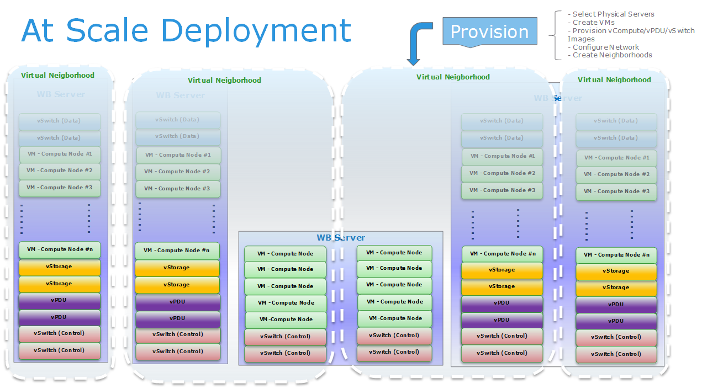

Overview
===================

InfraSIM provides the technology to simulate the interface and behavior of hardware devices including compute, storage, networking, and smart PDU(Power Distribute Units).
It leverages the technology of virtualization which enables to simulate a big amount of hardware devices with limited physical resources. And these simulated hardware devices can be configured to construct an @scale infrastructure.

Data Center element simulating
------------------------------------

At single node level, InfraSIM provides:

  * **Precisely-simulating of bare-metal hardware node:** Server, PDU hardware configuration, manufacture information, vendor-specific interfaces and functionalities, etc
  * **Mechanism for customizing sub-component of node.** i.e. Configuration and properties of Drive, NIC and processors; enclosure management subsystem.
  * **Configuring and manipulating platform firmware - BIOS, POST and BMC - behavior**
  * **Easy way to simulating hardware failure**

Virtual infrastructure powered by InfraSIM
-------------------------------------------------

To simulate scale out infrastructure, InfraSIM allows setting up, configuring one heterogeneous hardware infrastructure, with below advantages, which provides a total solution for CI application development and test.
  
  * Network topology simulation
  * Automatic deployment on demand
  * Optimized footprint - Large scale deployment on top of limited number of servers

The diagram below illustrates the development concept of the @Scale deployment.

