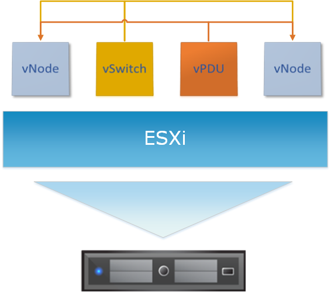

User Guide
===============================================
This chapter will deep to the InfraSIM usage of deploying large scale virtual infrastructure. If simply virtual compute nodes or small scale infrastructure already works, you can refer to `Quick Start </gettingstart.html>`_ to get that setup.

Many functionalities described in this chapter, such as vRackSystem for InfraSIM deployment and virtual PDU are supported only on top of `VMWare vSphere Client(ESXi) <https://www.vmware.com/products/vsphere>`_ as of now. In `Build, Package and Deployment </builddeploy.html>`_ chapter, we describe how to build and deploy virtual compute node on top of KVM, Docker, Virtual Box, VMWare workstation and ESXi.

**Notice:** Before you start this chapter, please follow the instructions in `Build vNode and vPDU </how_tos.html#build-vnode-and-vpdu>`_ to build the vNode and vPDU OVA images, which can be deployed on ESXi.

**Index of User Guide:**

#. `Setup InfraSIM on ESXi </userguide.html#setup-infrasim-on-esxi>`_

   * How to install ESXi on physical server
   * Deploy and control vNode
   * Deploy and control vPDU
   * Access vBMC data
   * vSwitch setup

#. `vRackSystem User Manual </userguide.html#vracksystem>`_
#. `Test InfraSIM </userguide.html#puffer-infrasim-test>`_

Setup InfraSIM on ESXi
------------------------------------------------

Below diagram shows virtual infrastructure deployed on one ESXi instance. Please follow the step by step manual in the following sections to setup this environment.

Install ESXi on Physical Server
~~~~~~~~~~~~~~~~~~~~~~~~~~~~~~~~~~~~~~~~~~~~~~~

#. Requirement of physical server
    The physical server must support ESXi 6.0 and it should be allocated at least 3 NIC ports. The first NIC port is used for the admin network connection. The second and third NIC ports are used for control network connection(The second NIC is required. The third NIC is optional). The fourth NIC port is used for data network connection (optional).

#. Setting Up Network Connections
    You must have IP addresses for the physical servers in the test environment to be used to configure the VMKernal port of ESXi and called as ESXi_Admin_IP.

    * Allocate or reserve a static IP address from the Lab admin.
    * Connect the server’s admin NIC ports into the Lab network.
    * To set up a multiple server environment, connect Port C1 on each server by using an Ethernet switch.

#. Install ESXi 6.0
    From the VMWare web site, a 60-day free trial version is available after user registration.

    * Go to https://my.vmware.com/web/vmware/details?downloadGroup=ESXI600&productId=490&rPId=7539
    * Download the VMWare vSphere Hypervisor 6.0 (ESXi6.0) ISO image.
    * Install ESXi 6.0 on each physical server.
    * Configure the static IP address ESXi_Admin_IP on first NIC port.
    * Set the Administrator user name by using the format <User Name>.
    * Set the Administrator Password by using the format <Password>.

#. Installing VMWare vSphere Client (Remote System)
    * Go to the VMWare web site.
    * Download the VMWare vSphere Client.
    * Install the client on a remote system that can connect to the physical servers.

#. Configuring the Virtual Network
    * Launch the vSphere client and connect to ESXi on the physical server by using ESXi_Admin_IP.

    * On the Configuration tab, click Add Networking, to create the Control vSwitch. In the example, the network label is "VM Network 2".
        .. image:: _static/virtualnetwork1.png
            :height: 400
            :align: center

    * Select Virtual Machine
        .. image:: _static/virtualnetwork2.png
            :height: 400
            :align: center

    * Select Create a vSphere standard switch > vmnic2.
        .. image:: _static/virtualnetwork3.png
            :height: 400
            :align: center

    * In the Network Label field, type port group name on target switch.
        .. image:: _static/virtualnetwork4.png
            :height: 300
            :align: center

    * Enable the SSH service on ESXi. To do this, open the Configuration tab and select Security Profile. Then select SSH and click Properties to set the SSH (TSM-SSH) to start and stop manually.
        .. image:: _static/ssh_ESXi.png
            :height: 300
            :align: center

.. include:: compute_node_simulation.rst

.. include:: pdu_simulation.rst

.. include:: bmc_emulation.rst

.. include:: vswitch_emulation.rst

.. include:: vracksystem.rst

.. include:: test.rst
