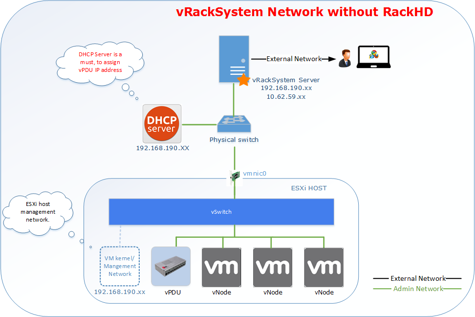

vRackSystem
------------------------------------
This sections describes using infraSIM utility **vRackSystem** to do large scale infrastructure deployment and management on top of ESXi.

Overview
~~~~~~~~~~~~~~~~~~~~~~~~~
vRackSystem is web-based system designed to efficiently build and manage virtual infrastructure, including below features:

* Manage ESXi resources
* Deploy the virtual nodes (vNode and vPDU) built by **InfraSIM**.
* Control(Power on / Power Off / Reset / Delete) the virtual nodes and virtual PDU.
* Bind vPDU outlets with virtual nodes (vNode and vPDU).
* vNodes customization (Customize sub-component, processor, memory, Drive and NIC).
* RackHD integration and testing

RackHD (https://github.com/RackHD) is an open source project that provides hardware orchestration and management through APIs. More information can be found at http://rackhd.readthedocs.org/en/latest/.

Server Requirements
~~~~~~~~~~~~~~~~~~~~~~~~~~~~~~~~~~~~~~~~~

**vRackSystem Prerequisite**

* Linux server with ssh installed and ssh public key generated
* Direct network connection to all the ESXi hosts to be managed
* External network connection to be accessible as a Web server.

The following diagrams illustrate vRackSystem networks.

Setting up Environment
~~~~~~~~~~~~~~~~~~~~~~~~~~~~~~~~~~~~~~~~~~~~~~~~~~

#. Install Python version 2.x, except version 2.7.9::

    sudo apt-get install python
    sudo apt-get install python-pip
    sudo apt-get install python-dev
    sudo apt-get install python-setuptools

#. Check whether Python was successfully installed and that the version is correct::

    python --version

#. Install the VMWare ovftool file.
    * Download the VMWare OVF bundle, version 4.1.0 for Linux. Go to https://my.vmware.com/group/vmware/details?productId=491&downloadGroup=OVFTOOL410 (4.1.0 version, for Linux).
    * Copy the bundle file to the vRackSystem server.
    * Install the OVF tool::

        sudo bash VMware-ovftool-4.1.0-2459827-lin.x86_64.bundle

#. Install MySQL::

    sudo apt-get install mysql-server
    sudo apt-get install python-mysqldb

#. Import a database.
    * Copy the existing databases file (vracksystem.sql) from XXX to your server.

    * Enter your database::

        mysql -u <your mysql account> -p

    * Enter your MySQL password.

    * Import the databases file::

        source /path/to/vracksystem.sql

#. Clone the vRackSystem code from github repository: https://github.com/InfraSIM/vracksystem
#. Change **vracksystem/ova/** folder privilege to 777. ::

        cd vracksystem
        sudo chmod -R 777 ova/

#. Install the Python packages::

    cd vracksystem
    sudo pip install -r requirements.txt

#. Update the database connection information.
    Use your MySQL account username and password in the /vracksystem/AutodeployUI/settings.py file. ::

       DATABASES = {
            'default': {
                'ENGINE': 'django.db.backends.mysql',
                'NAME': 'AutoDeployUI',
                'USER': '<your mysql account>',
                'PASSWORD': '<your mysql password>',
                'HOST':'localhost',
            }
        }

#. Copy the OVA images, including RackHD OVA images, vNode and vPDU images, to the /vracksystem/ova/ directory.

#. Start vRackSystem::

    cd vracksystem
    python manage.py runserver 0.0.0.0:<port>

#. To access the vRackSystem GUI go to http://<server IP>:<port>/login, use account admin/admin to login.

User Manual
~~~~~~~~~~~~~~~~~~~~~~~~~~~~~~~~~~~~~~~~~~~~~~~~~~

**Features Introduction:**

* Resource Management. Currently only supported with ESXi.
* vNode/vPDU deployment and control.
* vPDU Settings
* vNode Customization. Support to customize Drive/NIC to a virtual machine.
* Support

**Step by Step Manual:**

#. Login the system by accessing http://<server IP>:<port>/login.
    * Login the system with account admin/admin.

    * Contact us when you cannot access the system.
    .. image:: _static/vracksystem1.PNG
        :align: center

#. Main page.
    * After login, you can see the main page.
    .. image:: _static/vracksystem2.PNG
        :align: center

#. Resource Management.
    * Go to "Resource Management" -> "ESXi".

    * You can Add / Edit / Delete an ESXi resource.
    .. image:: _static/vracksystem3.PNG
        :align: center

    .. image:: _static/space.png
            :align: center

    .. image:: _static/vracksystem4.PNG
        :align: center

#. vNode/vPDU deployment and control.
    * Go to "vNode Deploy" -> "Upload OVA" to upload an OVA image to vRackSystem Server.
        .. image:: _static/uploadova.PNG
            :align: center

    * Go to "vNode Deploy" -> "Deploy vNodes" to deploy vNodes or vPDU. The process is as below.
        - Select an ESXi.

        - The "Datastore" information will be loaded automatically.

        - Select the "Power Type". It means the power status after the deployment of the nodes.

        - Input the duration, it means interval between two nodes deployment.

        - Choose a "Node Type". If you choose vNode, you need to select the Control Network. Otherwise, Control Network is not a must.

        - The "vNode Image" on vracksystem will be automatically loaded. If there are no OVA image that you need, please go to "vNode Deploy" -> "Get OVA" to download.

        - Input the "Node Count" you want to deploy.

        - Click "Deploy" to start the deploy process.

          .. image:: _static/vracksystem5.PNG
             :align: center

    * Go to "vNode Deploy" -> "Control vNodes" to control the vNodes. The process is as below.
        - Select an "ESXi Host".

        - The hardware information of the ESXi host and also the virtual machines on the ESXi will display automatically.

        - You can choose several virtual machine to do "Power On", "Power Off", "Delete", "Reset".

          .. image:: _static/vracksystem6.PNG
             :align: center

        - Also you can input some text in the search box to search the virtual machine whose name contains the search keyword.

          .. image:: _static/vracksystem7.PNG
             :align: center

#. vPDU Setting.
    * Go to "vPDU Setting" -> "vPDU Basic Info" to get the PDU basic information. The process is as below.
        - Select an "ESXi Host".

        - The PDU will be automatically loaded. Then choose a "PDU".

        - After you choose a PDU, you will get the name, IP and power status of the PDU.

        - You can restart the PDU by click "Restart PDU".
        .. image:: _static/vracksystem8.PNG
            :align: center

    * Go to "vPDU Setting" -> "ESXi Host" to check or set the PDU ESXi Host information. The process is as below.
        - Select an "ESXi Host".

        - The PDU will be automatically loaded. Then choose a "PDU".

        - After you choose a PDU, the ESXi Host information will list there.

          .. image:: _static/vracksystem10.PNG
             :align: center

        - If there's no "ESXi Host" bound there, please add one.

          .. image:: _static/vracksystem9.PNG
             :align: center

        - If there's already one "ESXi Host" there, you can delete it.

    * Go to "vNode Deploy" -> "Password List" to check and set the PDU password. The process is as below.
        - Select an "ESXi Host".

        - The PDU will be automatically loaded. Then choose a "PDU".

        - After you choose a PDU, the existing password list will be loaded automatically.

          .. image:: _static/vracksystem11.PNG
             :align: center

        - You can Add a new password for a PDU port.

          .. image:: _static/vracksystem12.PNG
             :align: center

    * Go to "vNode Deploy" -> "vNode Mapping" to check and set the PDU <-> Node mapping. The process is as below.
        - Select an "ESXi Host".

        - The PDU will be automatically loaded. Then choose a "PDU".

        - After you choose a PDU, the existing node mapping list will be loaded automatically.

          .. image:: _static/vracksystem13.PNG
             :align: center

        - You can "Add" / "Update" / "Delete" mappings.

          .. image:: _static/vracksystem14.PNG
             :align: center

#. vNode Customization.
    * Go to "vPDU Customization" -> "Add Drive" to add a drive for a virtual machine. This feature will support after SCSI drive supported. The process is as below.
        - Select an "ESXi Host".

        - The virtual machine on the ESXi host will be automatically loaded. Then choose a virtual machine.

        - Input an Integer disk size.

        - Click "Add" to add a drive for the virtual machine.

          .. image:: _static/vracksystem15.PNG
             :align: center

    * Go to "vPDU Customization" -> "Add NIC" to add a NIC for a virtual machine. The process is as below.
        - Select an "ESXi Host".

        - The virtual machine on the ESXi host will be automatically loaded. Then choose a virtual machine.

        - Input NIC name you want to add.

        - Click "Add" to add a drive for the virtual machine.

          .. image:: _static/vracksystem16.PNG
             :align: center

#. Support.
    * Go to "Support" to find support when you encounter issues.
        - Click "Document" to read our release document.

        - Click "Email" to email our with your comments and suggestions, or questions.

          .. image:: _static/vracksystem17.PNG
             :align: center

APIs
~~~~~~~~~~~~~~~~~~~~~~~~~

vRackSystem exposed a set of Restful APIs for easier integration with external systems and automation test. All of the Restful APIs are encapsulated by SwaggerUI, all the Restful APIs are visible in one web page. The access steps are as below:
 1. Login the system (http://<your server IP>:<port>/login/) with account: admin / admin.
 2. Access the REST APIs by http://<your server IP>:<port>/docs/ and you will get all the Restful APIs.

**REST APIs Introduction**

* GET /api/v1/esxi/
    Get all the esxi list maintain in vRackSystem.

* POST /api/v1/esxi/
    Add an ESXi server for vRackSystem to maintain. Need to provide ESXi host IP, username and password. After adding ESXi host, vRackSystem will assign a unique id for each ESXi host. This id will be used as index of many other APIs.

    .. list-table::
       :widths: 20 100
       :header-rows: 1

       * - Arguments
         - Description
       * - esxiIP
         - ESXi Host IP address
       * - username
         - ESXi Host username
       * - password
         - ESXi Host password

* GET /api/v1/esxi/{id}/
    Get the specific ESXi host information.

    .. list-table::
       :widths: 20 100
       :header-rows: 1

       * - Arguments
         - Description
       * - id
         - ESXi Host id

* PUT /api/v1/esxi/{id}/
    Update the information of one specific ESXi host. All the fields are needed.

    .. list-table::
       :widths: 20 100
       :header-rows: 1

       * - Arguments
         - Description
       * - id
         - ESXi Host id
       * - esxiIP
         - ESXi Host IP address
       * - username
         - ESXi Host username
       * - password
         - ESXi Host password

* PATCH /api/v1/esxi/{id}/
    Update the information of one specific ESXi host. Not all of the fields are needed.

    .. list-table::
       :widths: 20 100
       :header-rows: 1

       * - Arguments
         - Description
       * - id
         - ESXi Host id
       * - esxiIP
         - ESXi Host IP address
       * - username
         - ESXi Host username
       * - password
         - ESXi Host password

* DELETE /api/v1/esxi/{id}/
    DELETE one specific ESXi host.

    .. list-table::
       :widths: 20 100
       :header-rows: 1

       * - Arguments
         - Description
       * - id
         - ESXi Host id

* GET /api/v1/esxi/{id}/getvms
    Get the VMs in the specific ESXi host.

    .. list-table::
       :widths: 20 100
       :header-rows: 1

       * - Arguments
         - Description
       * - id
         - ESXi Host id

* POST /api/v1/esxi/{id}/getvminfo
    Get the detail information of a virtual machine in the specific ESXi host.

    .. list-table::
       :widths: 20 100
       :header-rows: 1

       * - Arguments
         - Description
       * - id
         - ESXi Host id
       * - name
         - virtual machine name in ESXi host

* POST /api/v1/esxi/{id}/poweronvm
    Power on a virtual machine in the specific ESXi host.

    .. list-table::
       :widths: 20 100
       :header-rows: 1

       * - Arguments
         - Description
       * - id
         - ESXi Host id
       * - name
         - virtual machine name in ESXi host

* POST /api/v1/esxi/{id}/poweroffvm
    Power off a virtual machine in the specific ESXi host.

    .. list-table::
       :widths: 20 100
       :header-rows: 1

       * - Arguments
         - Description
       * - id
         - ESXi Host id
       * - name
         - virtual machine name in ESXi host

* POST /api/v1/esxi/{id}/resetvm
    Reset a virtual machine in the specific ESXi host.

    .. list-table::
       :widths: 20 100
       :header-rows: 1

       * - Arguments
         - Description
       * - id
         - ESXi Host id
       * - name
         - virtual machine name in ESXi host

* POST /api/v1/esxi/{id}/destroyvm
    Delete a virtual machine in the specific ESXi host.

    .. list-table::
       :widths: 20 100
       :header-rows: 1

       * - Arguments
         - Description
       * - id
         - ESXi Host id
       * - name
         - virtual machine name in ESXi host

* GET /api/v1/esxi/{id}/hardware
    Get the hardware information of a specific ESXi host.

    .. list-table::
       :widths: 20 100
       :header-rows: 1

       * - Arguments
         - Description
       * - id
         - ESXi Host id

* GET /api/v1/esxi/{id}/datastores
    Get the data store information of a specific ESXi host.

    .. list-table::
       :widths: 20 100
       :header-rows: 1

       * - Arguments
         - Description
       * - id
         - ESXi Host id

* GET /api/v1/esxi/{id}/networks
    Get the networks information of a specific ESXi host.

    .. list-table::
       :widths: 20 100
       :header-rows: 1

       * - Arguments
         - Description
       * - id
         - ESXi Host id

* POST /api/v1/esxi/{id}/deploy
    Deploy a virtual nodes(vNode and vPDU) to a specific ESXi host.

    .. list-table::
       :widths: 20 100
       :header-rows: 1

       * - Arguments
         - Description
       * - id
         - ESXi Host id
       * - datastore
         - The datastore that the node will deploy to
       * - power
         - The power type after deployment. "on" will power on the node after deployment, "off" will not power on the node after deploy.
       * - duration
         - The interval between two nodes deployment.
       * - controlnetwork
         - The control network in vNode Deployment. Please set it to 0 when do vPDU deployment.
       * - nodetype
         - The node type you want to deploy. Please input vnode or vpdu
       * - count
         - The node count you want to deploy.
       * - ova
         - The OVA image name. If empty, it will choose the latest OVA files on vRackSystem.

* POST /api/v1/esxi/{id}/adddrive
    Add a drive for a specific virtual machine on an ESXi host.

    .. list-table::
       :widths: 20 100
       :header-rows: 1

       * - Arguments
         - Description
       * - id
         - ESXi Host id
       * - name
         - Virtual Machine name
       * - size
         - The drive size your want to add. Integer only.

* POST /api/v1/esxi/{id}/addnic
    Add a NIC for a specific virtual machine on an ESXi host.

    .. list-table::
       :widths: 20 100
       :header-rows: 1

       * - Arguments
         - Description
       * - id
         - ESXi Host id
       * - name
         - Virtual Machine name
       * - network
         - The network name you want to add for the virtual machine.

* POST /api/v1/esxi/{id}/setchassis
    Set chassis type for the virtual machines.

    .. list-table::
       :widths: 20 100
       :header-rows: 1

       * - Arguments
         - Description
       * - id
         - ESXi Host id
       * - vms
         - The virtual machine list that will set chassis type.

* POST /api/v1/esxi/{id}/vpduhostlist
    List the vPDU ESXi host configuration information.

    .. list-table::
       :widths: 20 100
       :header-rows: 1

       * - Arguments
         - Description
       * - id
         - ESXi Host id
       * - ip
         - vPDU IP Address

* POST /api/v1/esxi/{id}/vpduhostadd
    Add vPDU ESXi host configuration information.

    .. list-table::
       :widths: 20 100
       :header-rows: 1

       * - Arguments
         - Description
       * - id
         - ESXi Host id
       * - ip
         - vPDU IP Address

* POST /api/v1/esxi/{id}/vpduhostdel
    Delete vPDU ESXi host configuration information.

    .. list-table::
       :widths: 20 100
       :header-rows: 1

       * - Arguments
         - Description
       * - id
         - ESXi Host id
       * - ip
         - vPDU IP Address

* POST /api/v1/esxi/{id}/vpdumapadd
    Add vPDU <-> vNode mapping Information.

    .. list-table::
       :widths: 20 100
       :header-rows: 1

       * - Arguments
         - Description
       * - id
         - ESXi Host id
       * - ip
         - vPDU IP Address
       * - dt
         - datastore of where virtual machine was deployed
       * - name
         - virtual machine name
       * - pdu
         - vPDU number(1-6). Integer only.
       * - port
         - vPDU port(1-24). Integer only.

* POST /api/v1/esxi/{id}/vpdumaplist
    List vPDU <-> vNode mapping Information.

    .. list-table::
       :widths: 20 100
       :header-rows: 1

       * - Arguments
         - Description
       * - id
         - ESXi Host id
       * - ip
         - vPDU IP Address

* POST /api/v1/esxi/{id}/vpdupwdadd
    Add vPDU Password <-> vNode Password Information.

    .. list-table::
       :widths: 20 100
       :header-rows: 1

       * - Arguments
         - Description
       * - id
         - ESXi Host id
       * - ip
         - vPDU IP Address
       * - pdu
         - vPDU number(1-6). Integer only.
       * - port
         - vPDU port(1-24). Integer only.
       * - password
         - vPDU port password

* POST /api/v1/esxi/{id}/vpdupwdlist
    List vPDU Password<-> vNode Password Information.

    .. list-table::
       :widths: 20 100
       :header-rows: 1

       * - Arguments
         - Description
       * - id
         - ESXi Host id
       * - ip
         - vPDU IP Address
       * - pdu
         - vPDU number(1-6). Integer only.

* POST /api/v1/ova/list
    List the OVA images on vRackSystem server.

    .. list-table::
       :widths: 20 100
       :header-rows: 1

       * - Arguments
         - Description
       * - type
         - Virtual machine type. Please input node or pdu

* POST /api/v1/ova/upload
    Upload OVA images to server. This API can only function in automation script or UI. Not in the swagger UI.
