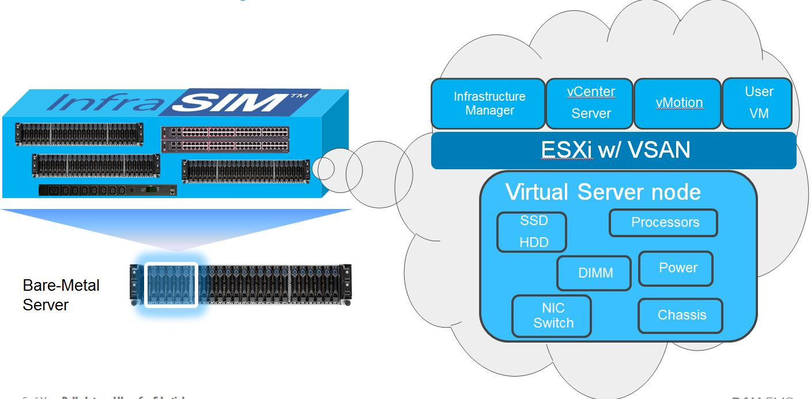

Why InfraSIM?
=========================

InfraSIM provides effective, economic way to simulate a bare-metal infrastructure on which engineering team can leverage to achieve purpose of: 

* Cost saving by simulating a scaled infrastructure with limited hardware materials
* Less dependency on hardware material which is in short supply
* Increase automation level and eventually increase development and testing efficiency 
* Increase test coverage by leveraging InfraSIM error injection functionality

There're many existing virtualization technologies like VMWare product, KVM, XEN, etc. They are aiming at provisioning generic virtual machines which contains computing power and storage capacities and networking functionalities. However, they're not sufficient in many engineering areas because of several missing pieces like: 

* **Vendor personality:** e.g. vendor identification information, SKU information, MFG information. No way to tell it is Cisco switch or brocade one; or tell it is dell server or IBM server; 
* **Vendor-specific functionality:** e.g. Dell Remote Access Controller; Cisco UCS appliance – provided central interface for management
* **Rack/Chassis/PDU/PS/Cooling:** fundamental building blocks of hardware. Particular software need to be aware of these info and would need to do some analytic and decision-making by checking details and running status of these components. 
* **Platform FW behavior:** VM provided only limited number of adjustable parameters; Limited emulation to FW behaviors. 

Virtual machines directly spawn by virtualization technologies are designed in way to be working forever, which might not be totally expected in some situations. There definitely are desires to simulate hardware failures to test robustness/error recovery scheme of software.

So we can conclude easily that current popular virtualization technologies are not designed to precisely simulate hardware and consequently it can’t be directly adopted in dev and validation activities, for software for purpose of infrastructure and hardware management and orchestration, which really have dependencies on detailed hardware properties.

While InfraSIM is really designed to precisely simulate hardware and bare-metal infrastructure in order to maximize the productivity and flexibility of you and your team.

InfraSIM Use Cases
------------------------------------

Currently, InfraSIM has successfully proved that it is capable of not only saving lots of cost of purchasing hardware material for setting up a pure bare-metal environment, but also providing many flexibilities in software developing and testing areas. Here're 2 cases where InfraSIM is leveraged for software application - RackHD and VMWare software - development and testing. 

InfraSIM as test infrastructure of RackHD™
~~~~~~~~~~~~~~~~~~~~~~~~~~~~~~~~~~~~~~~~~~~~~~~~~~~

**Notes:**
RackHD™ is an open source project that provides hardware orchestration and management through RESTful APIs. For more information about RackHD, go to http://rackhd.readthedocs.io.

#. At scale test
    We can validate RackHD functionalities by having it manage and orchestrate a virtual infrastructure with adjustable or big scalability. Then we can evaluate RackHD performance benchmark and ensure its functionalities in an environment with:
       * Big number of nodes
       * Diversity of node type - different type, model, vendors, etc
       * Increased complexity of network topology

    .. image:: _static/case_infrasim_rackhd.png
       :scale: 60%
       :align: center

#. Telemetry data testing
    InfraSIM allows generating and modifying server sensor readings that we can better test feature of telemetry data of RackHD.

#. Node provision
    InfraSIM allows customizing node device tree and manipulating FE behavior, we can better test node provision feature, for example, bootstrapping servers and deploying operating systems, hypervisors and applications.

#. Error injection
    Because InfraSIM is adopting software approach to simulate hardware, both elements and entire infrastructure, it provided more feasibility and easiness to simulate hardware failures to test our software error handing logic.

Running VMWare Virtualization Software inside InfraSIM Virtual server
~~~~~~~~~~~~~~~~~~~~~~~~~~~~~~~~~~~~~~~~~~~~~~~~~~~~~~~~~~~~~~~~~~~~~~~~~~~~~~~~~~~

